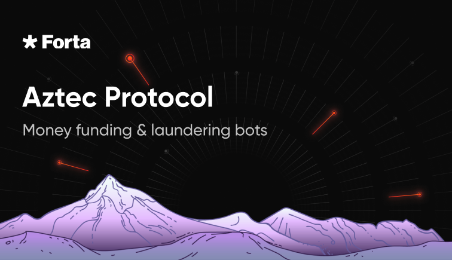

# Forta Bots: Funding & Money Laundering Though Aztec Protocol

## Intro

Most attacks begin and end with the use of private services that allow funding or withdrawals without revealing the
sender and recipient.

The most popular service among attackers of DeFi projects was the [Tornado Cash](https://twitter.com/tornadocash) mixer.
However, after it was blocked by The US Department of Treasury, other projects will likely take over this niche. 
[Aztec Protocol](https://aztec.network/), which is a privacy-first zk-rollup on Ethereum, could be a potential such project.

## Bots

### [Funded Account Interaction Bot](https://github.com/kovart/forta-aztec-protocol-money-laundering)

https://explorer.forta.network/bot/0x127e62dffbe1a9fa47448c29c3ef4e34f515745cb5df4d9324c2a0adae59eeef

This bot detects when an account that was funded by Aztec Connect interacts with a contract.
The severity of these findings is low, as they do not indicate malicious activity. However, in the presence of other
suspicious activity, they greatly increase the accuracy of attack detection.

### [Money Laundering Bot](https://github.com/kovart/forta-aztec-protocol-funding)

https://explorer.forta.network/bot/0xdccd708fc89917168f3a793c605e837572c01a40289c063ea93c2b74182cd15f

This bot detects when numerous large transfers are made to Aztec Connect, potentially indicating post-hacking money
laundering activity. All user transfers are summed up within a specified time and checked for exceeding the threshold.
The severity of such findings is high.

These bots will work similarly to existing bots for Tornado Cash, and I'm sure they will be able to increase the
accuracy as well as the number of detected attacks. 
